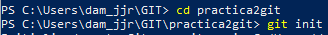

#    Practica 2 GIT

######   Jorge Jankovich Ramos - 2020

1. Crea un repositorio (directorio) llamado practica2git e inicializa el sistema de control de versiones
. 

2. Crea un fichero llamado contenido.txt con el siguiente texto:. 

3. Comprueba el estado del repositorio 

4. Añade el fichero a la zona de preparado
. 

5. Comprueba de nuevo el estado del repositorio. 

6. Cread un primer archivo "archivo1.txt"
Creamos el archivo archivo1.txt con ni. 

7. Hacer el primer commit con su comentario correspondiente. 

8. Comprueba de nuevo el estado del repositorio. 

9. Añadir el fichero a preparado. 

10. Hacer otro commit del fichero. 

11. Cambiar el mensaje del último commit por “Añadido la línea de MAC.”. 
